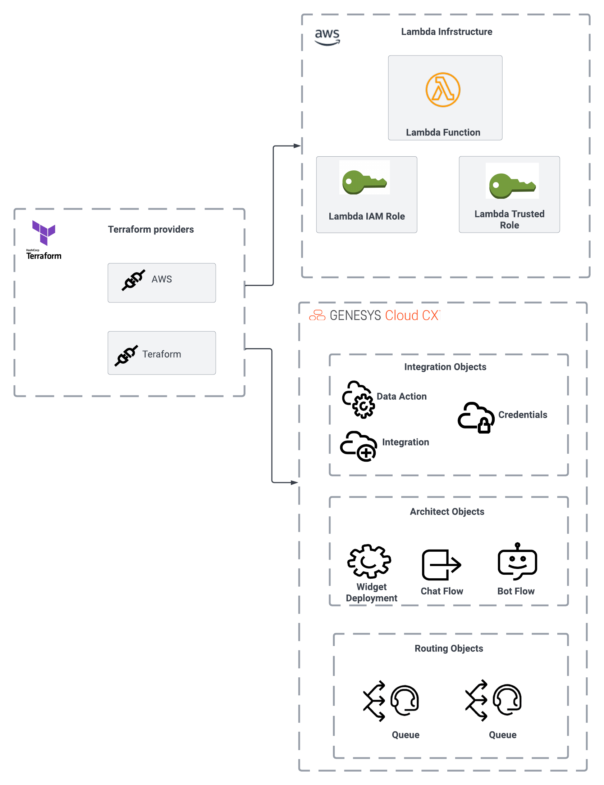
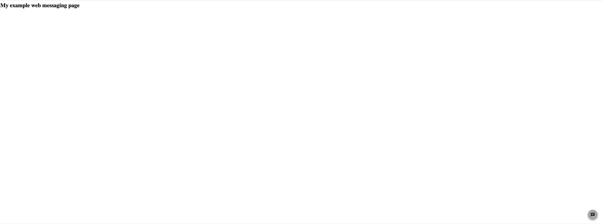
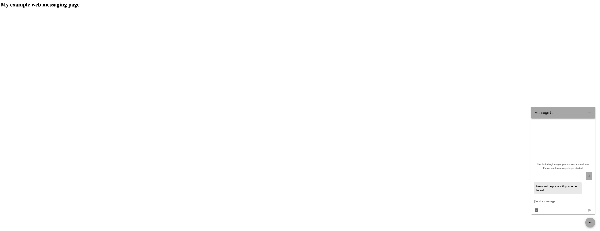
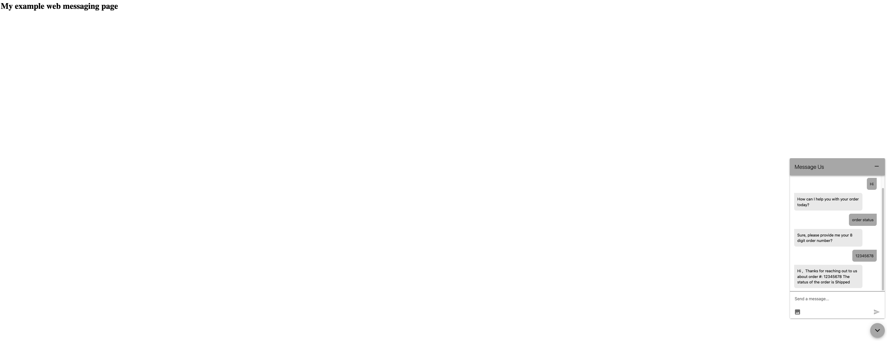

This Genesys Cloud Developer Blueprint demonstrates how to build a chat bot that uses Genesys Cloud's web messaging capabilities. This blueprint also demonstrates how to set up and configure a data action that invokes an AWS Lambda.



## Scenario

An organization is interested in building a chatbot that allows customers to check the status of their orders. Their goals are to:

* Implement a chatbot across multiple contact center channels. Initially, the bot flow will process inbound chats. By designing the flow in a non-channel-specific way, the dev team will be able to integrate it with a voice channel later.

* Quickly implement a chatbot on the organization's website with minimal coding effort.

* Integrate a chatbot with an AWS Lambda to speed overall delivery and promote reuse.

## Solution

This blueprint explains how to use the following Genesys Cloud capabilities:

1. **Bot Flow** - allows you to define the utterances and intents associated with speech and text detection in a chat or voice bot.
2. **Inbound Message Flow** - provides the integration and routing layer, getting the customer to the right information or people.
3. **Data Action**. provides the integration point to invoke a third-party REST web service or AWS lambda.
4. **Web Messaging Widget**. Tallows developers to create and configure a Javascript widget that deploys to their organization's website where customers interact with it.

Additionally, this blueprint explains how to deploy the AWS Lambda, all the AWS IAM roles, and all the CX as Code components from within a single Terraform/CX as Code project.  

## Solution components

* **Genesys Cloud CX** - A suite of Genesys Cloud services for enterprise-grade communications, collaboration, and contact center management. In this solution, you use an Architect bot, Architect message flow, a Genesys Cloud integration, data action, queues, and a web messaging widget.
* **CX as Code** - A Genesys Cloud Terraform provider that provides an interface for declaring core Genesys Cloud objects.
* **AWS Terraform Provider** - An Amazon-supported Terrform provider that provides an interface for declaring Amazon Web Services infrastructure resources.
* **AWS Lambda** - A serverless computing service for running code without creating or maintaining the underlying infrastructure. In this solution, AWS Lambda looks up a customer's order status.

## Software development kits

No Genesys Cloud SDKs are needed for this blueprint solution. However, if you want changes to the AWS Lambda, you need the Golang SDK to build it. For the latest Golang version, see [The Go programming language](https://go.dev/dl/ "Goes to the Downloads page on the Go website").

For more information, see [Optionally update the AWS Lambda](#optionally-update-the-aws-lambda "Goes to the Optionally update the AWS Lambda section").

## Prerequisites

### Specialized knowledge

* Administrator-level knowledge of Genesys Cloud
* AWS Cloud Practitioner-level knowledge of AWS IAM and AWS Lambda
* Experience with Terraform

### Genesys Cloud account

* A Genesys Cloud license. For more information see, [Genesys Cloud Pricing](https://www.genesys.com/pricing "Opens the Genesys Cloud pricing page") in the Genesys website.
* Master Admin role. For more information see, [Roles and permissions overview](https://help.mypurecloud.com/?p=24360 "Goes to the Roles and permissions overview article") in the Genesys Cloud Resource Center.
* CX as Code. For more information see, [CX as Code](https://developer.genesys.cloud/api/rest/CX-as-Code/ "Goes to the CX as Code page") in the Genesys Cloud Developer Center.

### AWS account

* An administrator account with permissions to access these services:
  * AWS Identity and Access Management (IAM)
  * AWS Lambda
  * AWS credentials

### Development tools running in your local environment

* Terraform (the latest binary). For more information, see [Download Terraform](https://www.terraform.io/downloads.html "Goes to the Download Terraform page") on the Terraform website.
* Golang 1.16 or higher. For more information, see [Downloads](https://go.dev/dl/ "Goes to the Downloads page") on the Go website.

## Optionally update the AWS Lambda

1. Have the Golang SDK installed on the machine.
2. Change to the `blueprint/lambda-orderstatus` directory.
3. Issue this build command: `GOARCH=arm64 GOOS=linux go build -tags lambda.norpc -o ./bin/bootstrap ./...`

This will build a Linux executable called `bootstrap` in the `bin` directory. The CX as Code/Terraform scripts compresses the executable and deploys the zip as part of the AWS Lambda deploy via Terraform.

:::primary
**NOTE**: The executable only runs on Linux. Golang allows the developer to build Linux executables on Windows and OS/X, but they will not be able to run them locally.
:::

## Implementation steps

### Clone the GitHub repository

Clone the [deploy-webmessaging-chatbot-with-lambda-blueprint](https://github.com/GenesysCloudBlueprints/deploy-webmessaging-chatbot-with-lambda-blueprint) GitHub repository on your local machine. The `deploy-webmessaging-chatbot-with-lambda-blueprint/blueprint` folder includes solution-specific scripts and files in these subfolders:

* `lambda-orderstatus` - Source code for the AWS Lambda used in this application
* `terraform` - All Terraform files and Architect flows that are needed to deploy the solution.

### Set up your AWS credentials

For information about setting up your AWS credentials on your local machine, see [Configuration](https://docs.aws.amazon.com/sdkref/latest/guide/creds-config-files.html "Goes to the Configuration page") on the AWS website.

### Set up your Genesys Cloud credentials

1. To run this project using the AWS Terraform provider, open a Terminal window and set the following environment variables:

* `GENESYSCLOUD_OAUTHCLIENT_ID` - This is the Genesys Cloud client credential grant Id that CX as Code executes against.
* `GENESYSCLOUD_OAUTHCLIENT_SECRET` - This is the Genesys Cloud client credential secret that CX as Code executes against.
* `GENESYSCLOUD_REGION` - This is the Genesys Cloud region in your organization.
* `AWS_ACCESS_KEY_ID` - This is the AWS Access Key you must set up in your Amazon account to allow the AWS Terraform provider to act against your account.
* `AWS_SECRET_ACCESS_KEY` - This is the AWS Secret you must set up in your Amazon account to allow the AWS Terraform provider to act against your account.
* `AWS_SESSION_TOKEN` - (If applicable) This is the AWS Session Token you must set up in your Amazon account to allow the AWS Terraform provider to act against your account.
* `AWS_REGION` - (Optional) This is the AWS Region where you want the lambda to be deployed.

2. Run Terraform in the Terminal window where you set the environment variables.

:::primary
**Note:** For this project, the Genesys Cloud OAuth client requires the Master Admin role.
:::

### Configure your Terraform build

You must define several values that are specific to your AWS region and Genesys Cloud organization.

In the blueprint/terraform/dev.auto.tfvars file, set the following values:

* `organizationId` - Your Genesys Cloud organization Id
* `awsRegion` - The AWS region (for example us-east-1, us-west-2) where you are going to deploy the target AWS lambda.
* `environment` - This is a free-form field that combines with the prefix value to define the name of various AWS and Genesys Cloud artifacts. For example, if you set the environment name to be `dev` and the prefix to be `dude-order-status` your AWS lambda, IAM roles, Genesys Cloud integration and data actions will all begin with `dev-dude-order-status`.
* `prefix`- This a free-form field that combines with the environment value to define the name of various AWS and Genesys Cloud artifacts.
* `genesysCloudScriptUrl` - The Genesys Cloud apps URL specific to your organization's Amazon region used in generating the HTML page to test the Web Component.
* `genesysCloudScriptEnv` - This is a short code for the environment. This value is found immediately following `https://apps.<<VALUE HERE>>.pure.cloud` from the `genesysCloudScriptUrl`.

The following is an example of the `dev.auto.tfvars` file that was created by the author of this blueprint.

```
organizationId = "011a0480-9a1e-4da9-8cdd-2642474cf92a"
awsRegion              = "us-west-2"
environment            = "dev"
prefix                 = "dude-order-status"
genesysCloudScriptUrl = "https://apps.usw2.pure.cloud"
genesysCloudScriptEnv = "usw2"
```

### Run Terraform

You are now ready to run this blueprint solution for your organization.

1. Change to the blueprints/terraform folder and issue these commands:

* `terraform plan` - This executes a trial run against your Genesys Cloud organization and shows you a list of all the AWS, and Genesys Cloud resources created. Review this list and make sure you are comfortable with the activity being undertaken before continuing.

* `terraform apply --auto-approve` - This does the actual object creation and deployment against your AWS and Genesys Cloud accounts. After the --auto--approve commands complete, you should see the approval step required before creating the objects.

After the `terraform apply --auto-approve` command completes, you should see the output of the entire run along with the number of objects successfully created by Terraform. Keep these points in mind:

* This project assumes you are running using a local Terraform backing state. This means that the `tfstate` files will be created in the same folder where you ran the project. Terraform does not recommend using local Terraform backing state files unless you run from a desktop and are comfortable with the deleted files.

* As long as your local Terraform backing state projects are kept, you can tear down the blueprint in question by changing to the `blueprint/terraform` folder and issuing a `terraform destroy --auto-approve` command. This destroys all objects currently managed by the local Terraform backing state.

### Test your deployment

After the Web messaging widget is deployed to your environment, you can use deployed widget locally in `/blueprint/terraform/web/index.html`.



Start the web messaging session.



You can also use our tool in the Genesys Cloud Developer Center to test the flow without deploying it to your website or using other tools.

1. Go to the [Web Chat/Messaging Tool Page](https://developer.genesys.cloud/devapps/web-chat-messenger "Goes to the Web Chat/Messaging Tool Page in the Genesys Cloud Developer Center") in the Genesys Cloud Developer Center.
2. Login to an admin account in the organization where you created your Genesys Cloud objects.
3. Go to the **Web messenger** tab > **Deployments**. Then, choose the messenger deployment you just created.
4. Once selected, click **Start Chat**. After the chat starts, send any message. You are then greeted by a chat bot that asks, "How can I help you with your order today?".
5. Respond by entering **order status**.
6. When prompted for your 8-digit order number, enter **12345678**.



You should see the response of `Hi, Thanks for reaching out to us about order #: 12345678. The status of the order is Shipped`. If you receive this response, the chat bot has successfully connected with the AWS lambda, which then successfully processed your request for the order status.

If you receive a message from a chatbot that there was a problem with your order, the AWS lambda did not deploy properly and Genesys Cloud had a problem invoking it.

## Additional resources

* [Genesys Cloud Web messaging and Messenger](https://developer.genesys.cloud/commdigital/digital/webmessaging/ "Goes to the Web messaging and Messenger page") in the Genesys Cloud Developer Center
* [Genesys Cloud About the data actions integrations](https://help.mypurecloud.com/?p=209478 "Opens the About the data actions integrations article") in the Genesys Cloud Resource Center
* [Genesys Cloud About the AWS Lambda data actions integration](https://help.mypurecloud.com/?p=178553 "Opens the About the AWS Lambda data actions integration article") in the Genesys Cloud Resource Center
* [Terraform Registry Documentation](https://registry.terraform.io/providers/MyPureCloud/genesyscloud/latest/docs "Opens the Genesys Cloud Terraform provider page") in the Terraform documentation
* [Genesys Cloud DevOps Repository](https://github.com/GenesysCloudDevOps "Goes to the Genesys Cloud DevOps repository page") in GitHub
* [deploy-webmessaging-chatbot-with-lambda-blueprint repository](https://github.com/GenesysCloudBlueprints/deploy-webmessaging-chatbot-with-lambda-blueprint "Goes to the deploy-webmessaging-chatbot-with-lambda-blueprint repository") in Github
